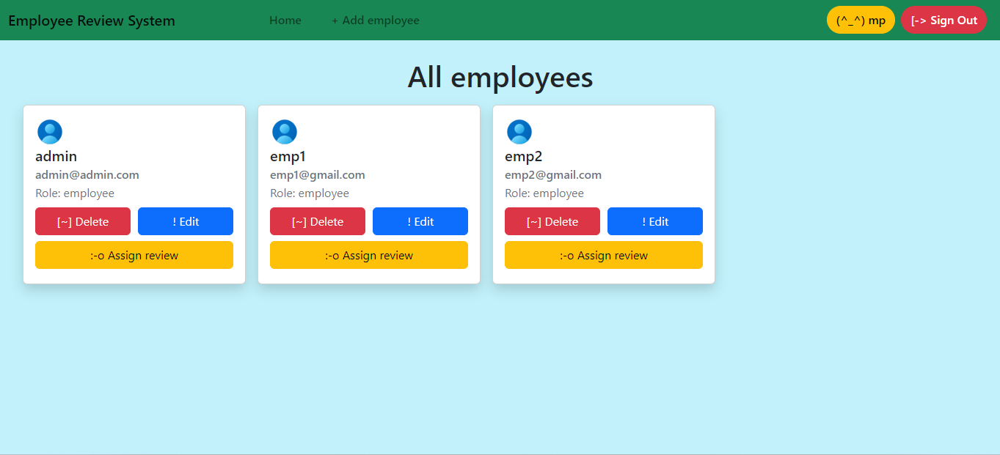
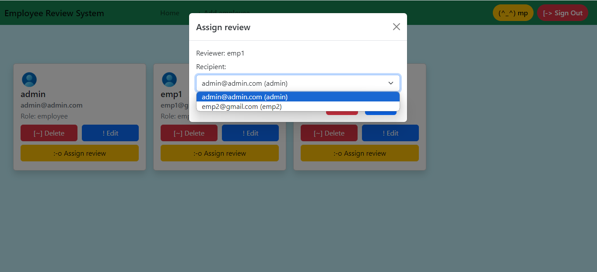
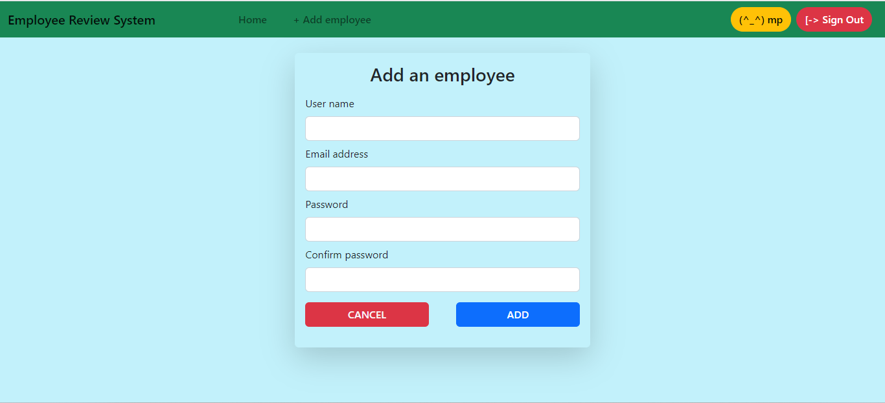

# Employee review system

This Employee review web application is created for employees to submit feedback toward each other's performance.

### Hosted link: [Employee review system](https://employee-review-system-vb6l.onrender.com/)

## Functionality

### Admin's functions

- Add employee
- Delete employee
- Update employee details
- Assign review to employee
- Update review of employee

### Employee's functions

- Submit reviews assigned to it
- View reviews given by others

## Getting started

- Fork the project
- Clone the forked repository in your local system
- Create .env file in the root directory and add the following:-
  - PORT="Your port number"
  - MONGODB_URL="Your MongoDB URL"
  - SESSION_SECRET_KEY="Your secret session key"
- Install all required packages

```bash
npm install
```

- Run project

```bash
npm start
```
## 🖼️ Screenshots



